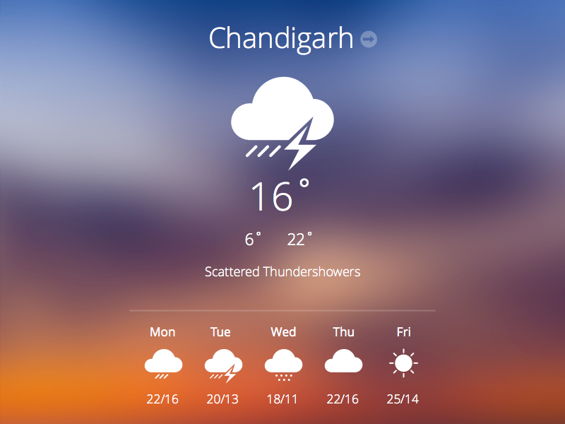

# CODSOFT
# Shaurya Chaturvedi - Frontend Developer Portfolio

Welcome to my personal portfolio website. This is a simple yet functional space where I showcase the work I've done, the skills I've built, and a bit about who I am as a developer. I created this site using basic web technologies to keep it lightweight, responsive, and easy to maintain.

## 🔗 Live Link

> [https://shaurya-chaturvedi.github.io/CODSOFT/](https://shaurya-chaturvedi.github.io/CODSOFT/)

---

## About the Project

This website includes:

- An "About Me" section with my intro and photo
- A neatly categorized Skills section
- A Projects gallery featuring three main projects
- A downloadable resume link
- A working contact form (using Formspree)
- GitHub, LinkedIn, and Email icons for connection
- A Dark Mode toggle for better accessibility

---

## 🛠️ Built With

- **HTML5**
- **CSS3**
- **JavaScript**
- **AOS (Animate On Scroll)** – for smooth entry animations
- **Font Awesome** – for icons
- **Formspree** – to make the contact form functional without a backend

---

## Screenshots





---

## Folder Structure

```
CODSOFT/
├── index.html
├── ShauryaResume.pdf
├── Shaurya2.jpeg
├── PFSS.png
├── TM.png
├── weather-app-icons.jpg
└── README.md
```

---

## Running the Project Locally

You can easily open the project on your local machine:

```bash
git clone https://github.com/shaurya-chaturvedi/CODSOFT.git
cd CODSOFT
```

Then just open `index.html` in your browser.

---

## How I Deployed It

I deployed this project using GitHub Pages:

1. Pushed the code to the `main` branch of my repo.
2. Went to `Settings > Pages` on GitHub.
3. Selected the source as `main` branch and root folder.
4. GitHub generated the live site automatically at the link shared above.

---

## Contact Me

Feel free to reach out or connect:

-  [amulya112005pandey@gmail.com](mailto:amulya112005pandey@gmail.com)
-  [LinkedIn](https://www.linkedin.com/in/shaurya-chaturvedi-41315135b)
-  [GitHub](https://github.com/shaurya-chaturvedi)

---

## License

Open-sourced under the MIT License. You’re welcome to fork it and build on top of it.

---

Thanks for checking out my work!
